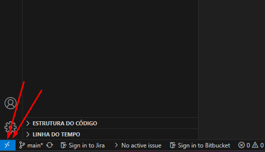
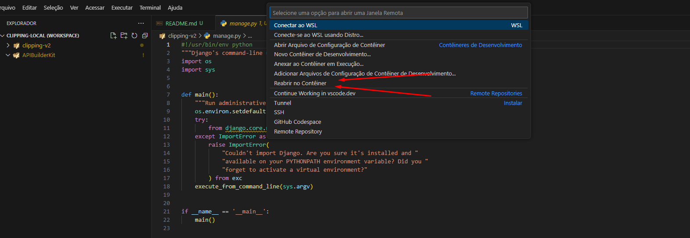
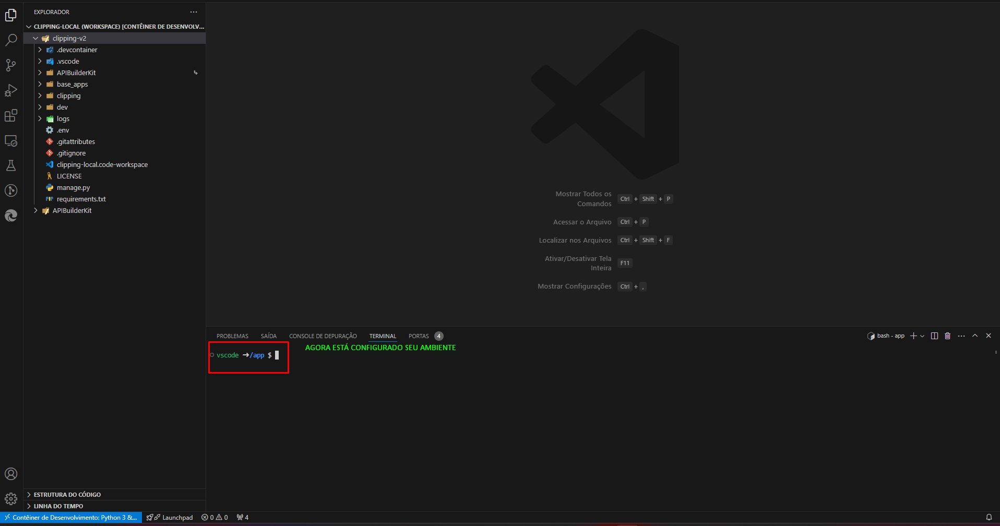

# PASSO A PASSO - Ambiente

- Instalar `Dev containers` no VSCode.

- Copiar a pasta `.devcontainer` que está dentro da pasta `dev` para a raiz do projeto.

  - Dentro da pasta `.devcontainer` na linha `10`, altere o caminho `<CAMINHO-DO-APIBuilderKit>` para o caminho da pasta onde está o `APIBuilderKit`.

- Copiar o arquivo `clipping-local.code-workspace` que está dentro da pasta `dev` para a raiz do projeto.

  - No VSCode abra o `clipping-local.code-workspace`, e no canto inferior direito irá aparecer um botão com nome `Abrir o Workspace`, clique nele.

    

    

    

  - Após rodar abrir o WORKSPACE irá aparecer um alerta pedindo para `Reabrir no Container`, caso não apareça, siga passo a passo a imagem abaixo, e se aparecer, clique em `Reabrir no Container`.

  - Após o docker vai instalar todas as dependências e criar as imagens. E feito isso, rode o comando abaixo e ele irá criar uma pasta como `LINK SIMBÒLICO`.
    ```
        ln -s "/links/APIBuilderKit" APIBuilderKit
    ```

- Faça as migrações

  ```
      python manage.py migrate
  ```

- Crie um superusuário

  ```
      python manage.py createsuperuser
  ```

- Rode a aplicação
  ```
      python manage.py runserver
  ```

## Alterer o usuario da maquina para nao utilizar o sudo sempre que for fazer algo
```
sudo chown -R lucas:lucas .git
```

- Pegar credenciais ssh
```
vscode ➜ /app $ 
vscode ➜ /app $ cat  ~/.ssh/id_ed25519.pub
ssh-ed25519 AAAAC3NzaC1lZDI1NTE5AAAAIIuIVtZ+PKMaIQo5T/2oejiT2zEfCRq5s3qFvQiHdo6T lukasmulekezika2@gmail.com
```